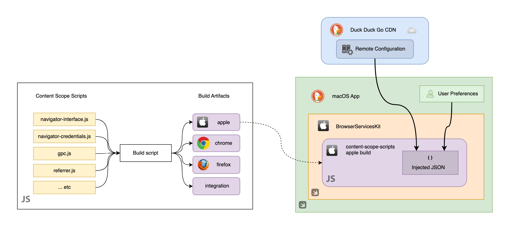

# Content Scope Scripts

Content Scope Scripts handles injecting DOM modifications in a browser context; it's a cross-platform solution that requires some minimal platform hooks.

## Quick Start

Content Scope Scripts provides a unified API for features running in web page DOM environments across multiple platforms (Firefox, Chrome, Safari, Android, iOS). Features are loaded dynamically based on remote configuration and can be enabled/disabled per site.

## Documentation

📚 **Detailed documentation is available in the [docs](./docs/) directory:**

- **[API Reference](./docs/api-reference.md)** - Complete reference for the Content Scope Features API
- **[Features Guide](./docs/features-guide.md)** - How to develop features and understand the feature lifecycle  
- **[Platform Integration](./docs/platform-integration.md)** - Platform-specific implementation details
- **[Development Utilities](./docs/development-utilities.md)** - Scope injection utilities and development tools
- **[Testing Guide](./docs/testing-guide.md)** - Local testing and development workflow

## Key Concepts

### Project Structure

Content Scope Scripts contains two main sub-projects:

- **[Special Pages](../special-pages/)** - HTML/CSS/JS applications loaded into browsers (DuckPlayer, Release Notes, New Tab page, etc.)
- **Injected Features** - Features injected into websites (privacy protections, compatibility fixes, DOM manipulations)

> **For Special Pages development**, see the [Special Pages README](../special-pages/README.md) for detailed getting started instructions.

### Features
Features are JavaScript modules running in web page DOM environments. Each feature:
- Extends the `ConfigFeature` class for remote configuration support
- Implements the feature lifecycle (`load`, `init`, `update`)
- Can be enabled/disabled per site via remote configuration

### Platform Support
- **Firefox**: Standard extension content scripts
- **Apple/Android**: UserScripts with string replacements
- **Other browsers**: Base64-encoded script injection

### API
The global `contentScopeFeatures` object provides:
- `load()` - Initialize features that may cause loading delays
- `init(args)` - Main feature initialization with platform/site configuration
- `urlChanged()` - Handle Single Page App navigation
- `update()` - Receive browser updates

---

## Architecture Overview



*High-level overview of how Content Scope Scripts are built and integrated into platforms (example: macOS).* 

## Development

### Quick Test
```shell
npm test
```

### Individual Commands
```shell
npm run test-unit      # Unit tests (Jasmine)
npm run test-int       # Integration tests (Playwright)  
npm run build          # Build platform-specific artifacts
npm run fake-extension # Runs an example extension used within the integration tests
```

### Project Structure
- `src/features/` - Feature implementations
- `entry-points/` - Platform-specific entry points
- `unit-test/` - Unit test suite
- `integration-test/` - Integration test suite

> **For detailed development setup instructions, debugging tips, and test build workflows, see the [Development Utilities](./docs/development-utilities.md) and [Testing Guide](./docs/testing-guide.md).**

**Running specific tests:**

To run a specific test or test suite, you can use the `--grep` flag to filter tests by name:

```shell
# Run tests containing "Test infra" in their name
npx playwright test pages.spec.js --grep "Test infra"

# Run tests containing "Conditional frame matching" in their name
npx playwright test pages.spec.js --grep "Conditional frame matching"

# Run tests in headed mode (shows browser window)
npx playwright test pages.spec.js --grep "Test infra" --headed
```

**Debugging tests:**

For debugging, you can run tests in headed mode and add debugging output:

```shell
# Run with browser visible and debugging enabled
npx playwright test pages.spec.js --grep "Test infra" --headed --debug
```

#### Feature Build process

To produce all artefacts that are used by platforms, just run the `npm run build` command.
This will create platform specific code within the `build` folder (that is not checked in)

```shell
npm run build
```

For detailed information about any specific topic, please refer to the [documentation](./docs/).
