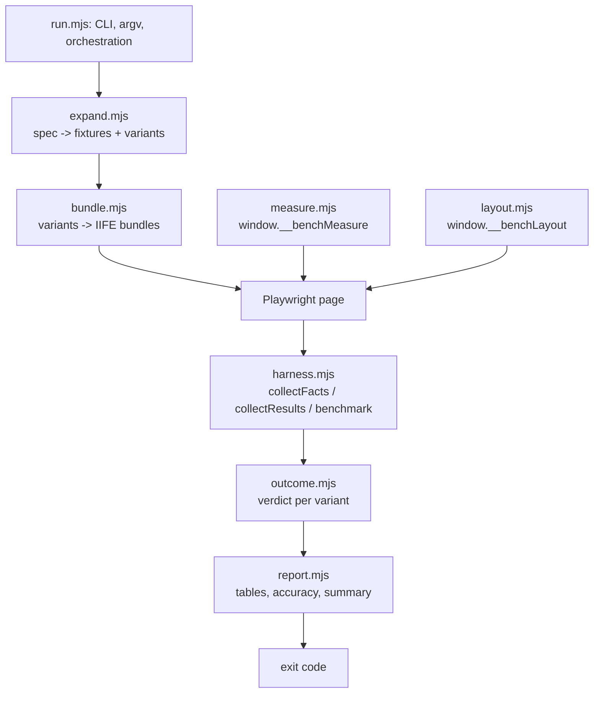

# Harness core

The benchmarking machinery itself. Each module carries a header explaining what it does and
why it is shaped the way it is; this file covers only what no single module can state.

## The pipeline

`run.mjs` and `drift-guard.mjs` stay outside this directory as entry points. `lib/` is
scaffolding for writing experiments, not infrastructure for running them.

## Three rules that span modules

**Decision logic belongs here, not in `run.mjs`.** `expand.mjs` and `outcome.mjs` were
extracted from the runner for one reason: `run.mjs` parses `argv` and calls `process.exit()`
at import time, so nothing inside it can be reached from a test. Those two were its least
observable logic and its most consequential — between them they decide which fixtures run and
what the exit code is. Anything comparable that gets added should land in a module here, and
should reject bad input by throwing `SpecError` rather than by exiting, so a test can assert
on the message while the runner still turns it into a one-line failure.

**In-page functions close over nothing.** Everything in `harness.mjs` is serialised by
Playwright and re-parsed inside the browser, so it can have no imports and no closure over
module scope; everything it needs arrives as an argument. `measure.mjs` and `layout.mjs` are
the deliberate exception: they are bundled as `window.__benchMeasure` and
`window.__benchLayout` (see `bundleMeasureCore` and `bundleLayoutCore`), which is what lets
the DOM path, the Node-side string path and the in-page functions share one implementation of
sampling and of layout control rather than carrying three copies.

**Layout is a property of the run, not of the code under test.** The harness imposes
invalidation inside each timed sweep, so every variant pays the identical style write and only
the ones needing geometry pay to resolve it. A variant that dirties layout itself charges its
own setup to its own timing and cannot be compared against one that does not.

## Where the fragile parts are

Two of these modules have been wrong in ways that produced plausible output rather than an
error, which is the failure mode a benchmark is most dangerous for. If you change either,
read its tests first.

- **`layout.mjs`** — the invalidation was once a root `padding-top` toggle, which shifts the
  root box and leaves every descendant's layout valid. The reflow was O(1) at any page size,
  `innerText` measured identical warm and dirty at 2k, 20k and 100k rows, and nothing in the
  output suggested the result was fabricated. The self-check that now guards this had its own
  version of the bug: a clean baseline rounding to zero made the ratio `Infinity`, which
  cleared every threshold.
- **`run.mjs`'s `readMemory`** — `Runtime.getHeapUsage().usedSize` excludes V8's large-object
  space, so a single allocation over roughly 128 KB is invisible while the same bytes in small
  pieces are reported correctly. That is backwards for the comparison it is most often reached
  for, and it flatters whichever strategy uses more memory. The caveat is on the function.
