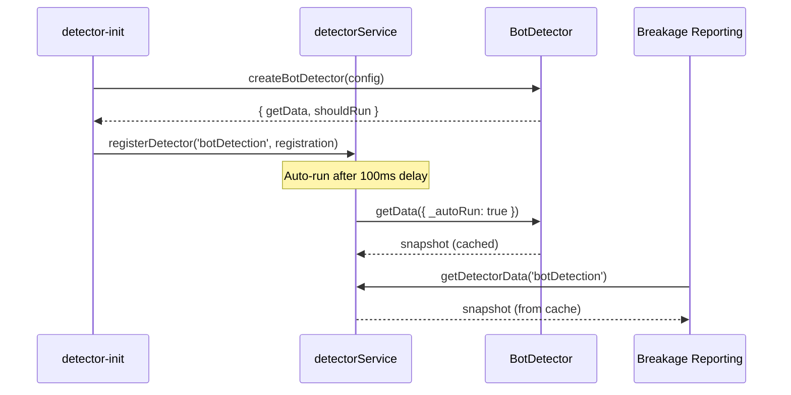

# Detector Service

This directory contains a lightweight detector service that runs inside content-scope-scripts. Detectors are automatically registered during the `load()` phase and any feature can query their latest results (breakage reporting, native PIR, debug tooling, etc.).

The current implementation focuses on synchronous, on-demand collection with caching. Continuous monitoring (mutation observers, polling, batching) can be layered on later without changing the public API.

## API Snapshot



### Core helpers

- `registerDetector(detectorId, { getData, shouldRun?, refresh?, teardown? })`
- `getDetectorData(detectorId, { maxAgeMs }?)`
- `getDetectorBatch(detectorIds, options?)`

Detectors return arbitrary JSON payloads. Include timestamps if consumers rely on freshness.

## Directory Layout

```
detectors/
├── detector-service.js            # registry + caching service
├── detector-init.js               # initializes detectors from bundledConfig
├── default-config.js              # default detector settings
├── detections/
│   ├── bot-detection.js           # CAPTCHA/bot detection
│   ├── fraud-detection.js         # anti-fraud/phishing warnings
│   ├── youtube-ads-detection.js   # YouTube ad detection
│   └── detection-base.js          # optional base for observer-style detectors
└── utils/
    └── detection-utils.js         # DOM helpers (selectors, text matching, visibility, domain matching)
```

## How It Works

### Initialization

Detectors are automatically registered during the content-scope-features `load()` phase:

1. `content-scope-features.js` calls `initDetectors(bundledConfig)` during page load
2. `detector-init.js` reads the `web-interference-detection` feature config
3. Default detector settings are merged with remote config
4. Detectors are registered with the service using `registerDetector()`
5. After `autoRunDelayMs` delay (default 100ms), detectors with `autoRun: true` execute automatically
   - This delay lets the DOM settle after initial page load
   - Auto-run calls check gates (domain + `shouldRun()`)
   - Results are cached for later manual calls

### Remote Configuration

Detectors are controlled via `privacy-configuration/features/web-interference-detection.json`:

```json
{
  "state": "enabled",
  "settings": {
    "autoRunDelayMs": 100,
    "interferenceTypes": {
      "botDetection": {
        "hcaptcha": {
          "state": "enabled",
          "vendor": "hcaptcha",
          "selectors": [".h-captcha"],
          "windowProperties": ["hcaptcha"]
        }
      },
      "fraudDetection": {
        "phishingWarning": {
          "state": "enabled",
          "type": "phishing",
          "selectors": [".warning-banner"]
        }
      }
    }
  }
}
```

#### Domain Gating

Detectors can be restricted to specific domains using a per-detector `domains` field:

- **Domain patterns**:
  - Exact match: `"youtube.com"`
  - Wildcard: `"*.youtube.com"` (matches www.youtube.com, m.youtube.com, etc.)
  - Substring: `"youtube.com"` also matches `www.youtube.com` for convenience

Example:
```json
{
  "settings": {
    "interferenceTypes": {
      "fraudDetection": {
        "domains": ["*.bank.com", "*.financial.com"],
        ...
      }
    }
  }
}
```

#### Auto-Run

Detectors can be configured to run automatically on page load:

- **`autoRun: true`** (default): Run detector automatically after page load
  - Gates are checked (domain + custom `shouldRun()`)
  - Results are cached immediately
  - Runs after configurable delay (see `autoRunDelayMs`)
  - Useful for detectors that should always gather data (bot detection, fraud detection)

- **`autoRun: false`**: Only run when explicitly called
  - Gates are skipped for manual calls
  - Useful for expensive detectors or event-driven scenarios

- **`autoRunDelayMs`** (global setting, default: 100): Milliseconds to wait before running auto-run detectors
  - Allows DOM to settle after page load
  - Can be tuned per-site or globally
  - Use 0 for immediate execution, higher values for slower-loading pages
  - **How it works**: After detectors are registered, a single `setTimeout` schedules all auto-run detectors to execute in batch after the delay

Example:
```json
"settings": {
  "autoRunDelayMs": 250,  // Wait 250ms before auto-running detectors
  "interferenceTypes": {
    "botDetection": {
      "autoRun": true,  // Run automatically with gates
      "domains": ["*.example.com"],
      ...
    },
    "expensiveDetector": {
      "autoRun": false,  // Only run on-demand, skip gates
      ...
    }
  }
}
```

### Consuming Detector Data

Features can directly import and use the detector service:

```javascript
import { getDetectorBatch } from '../detectors/detector-service.js';

// In breakage reporting feature - gates bypassed automatically for manual calls
const detectorData = await getDetectorBatch(['botDetection', 'fraudDetection']);
// Returns: { botDetection: {...}, fraudDetection: {...} }
```

**Behavior:**
- **Manual calls** (like above): Gates are bypassed, detector always runs
- **Auto-run calls**: Gates are checked (domain + `shouldRun()`)
- **Caching**: Results cached with timestamp, use `maxAgeMs` to force refresh

**Options:**
- `maxAgeMs`: Maximum age of cached data in milliseconds before forcing refresh

## Adding New Detectors

1. **Create detection logic** under `detections/`:
   - Export a `createXDetector(config)` factory function
   - Return an object with `{ getData, shouldRun?, refresh?, teardown? }`
   - Use shared utilities from `utils/detection-utils.js`

2. **Add default config** to `default-config.js`:
   - Define default selectors, patterns, and settings
   - These serve as fallback if remote config is unavailable

3. **Register in detector-init.js**:
   - Import your detector factory
   - Add one line: `registerIfEnabled('myDetector', detectorSettings.myDetector, createMyDetector)`

4. **Add remote config** to `privacy-configuration/features/web-interference-detection.json`:
   - Define the detector's configuration schema
   - Optionally add `domains` field for domain gating
   - This allows remote enabling/disabling and tuning

5. **Consume the detector** in your feature:
   - Import `getDetectorData` or `getDetectorBatch`
   - Call with your detector ID to get results

### Custom Gate Functions

Detectors can optionally implement a `shouldRun()` gate function for custom precondition checks:

```javascript
export function createMyDetector(config) {
    return {
        // Optional gate function runs before getData()
        // Return false to skip detection entirely (returns null)
        shouldRun() {
            // Example: Only run if specific element exists
            return document.querySelector('#app-root') !== null;
        },

        async getData() {
            // This only runs if shouldRun() returns true
            // and domain gate passes
            return { detected: true, ... };
        }
    };
}
```

**Example: Detector that depends on another detector's results**

```javascript
import { getDetectorData } from '../detector-service.js';

export function createAdvancedBotDetector(config) {
    return {
        // Only run advanced detection if basic bot detection found something
        async shouldRun() {
            const basicBotData = await getDetectorData('botDetection');
            // Only run if basic detector found a bot/CAPTCHA
            return basicBotData?.detected === true;
        },

        async getData() {
            // Run expensive/detailed analysis only when needed
            return runAdvancedBotAnalysis(config);
        }
    };
}
```

**When to use `shouldRun()`:**
- Lightweight DOM precondition checks (e.g., element exists)
- Dependency on another detector's results (use `getDetectorData()` inside `shouldRun()`)
- Runtime feature detection
- Performance optimization to avoid expensive operations

**Gate execution order:**
1. Domain gate (from config)
2. Custom `shouldRun()` gate (if provided)
3. `getData()` (if all gates pass)

If any gate fails, `getDetectorData()` returns `null`.

Future enhancements—shared observers, background aggregation, streaming updates—can build on this service without breaking the public API.

