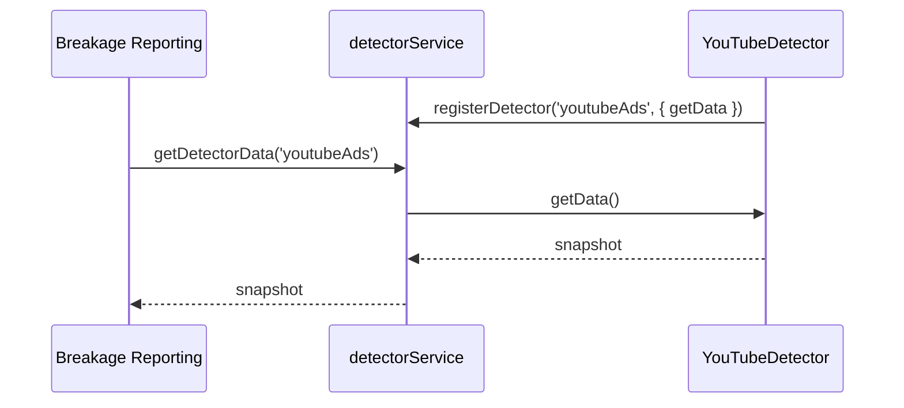

# Detector Service

This directory contains a lightweight detector service that runs inside content-scope-scripts. Detectors are automatically registered during the `load()` phase and any feature can query their latest results (breakage reporting, native PIR, debug tooling, etc.).

The current implementation focuses on synchronous, on-demand collection with caching. Continuous monitoring (mutation observers, polling, batching) can be layered on later without changing the public API.

## API Snapshot



### Core helpers

- `registerDetector(detectorId, { getData, refresh?, teardown? })`
- `unregisterDetector(detectorId)`
- `resetDetectors(reason?)`
- `getDetectorData(detectorId, { maxAgeMs }?)`
- `getDetectorBatch(detectorIds, options?)`

Detectors return arbitrary JSON payloads. Include timestamps if consumers rely on freshness.

## Directory Layout

```
detectors/
├── detector-service.js            # registry + caching service
├── detector-init.js               # initializes detectors from bundledConfig
├── default-config.js              # default detector settings
├── detections/
│   ├── bot-detection.js           # CAPTCHA/bot detection
│   ├── fraud-detection.js         # anti-fraud/phishing warnings
│   ├── youtube-ads-detection.js   # YouTube ad detection
│   └── detection-base.js          # optional base for observer-style detectors
└── utils/
    └── detection-utils.js         # DOM helpers (selectors, text matching, visibility)
```

## How It Works

### Initialization

Detectors are automatically registered during the content-scope-features `load()` phase:

1. `content-scope-features.js` calls `initDetectors(bundledConfig)`
2. `detector-init.js` reads the `web-interference-detection` feature config
3. Default detector settings are merged with remote config
4. Detectors are registered with the service using `registerDetector()`

### Remote Configuration

Detectors are controlled via `privacy-configuration/features/web-interference-detection.json`:

```json
{
  "state": "enabled",
  "settings": {
    "interferenceTypes": {
      "botDetection": {
        "hcaptcha": {
          "state": "enabled",
          "vendor": "hcaptcha",
          "selectors": [".h-captcha"],
          "windowProperties": ["hcaptcha"]
        }
      }
    }
  }
}
```

### Consuming Detector Data

Features can directly import and use the detector service:

```javascript
import { getDetectorBatch } from '../detectors/detector-service.js';

// In breakage reporting feature
const detectorData = await getDetectorBatch(['botDetection', 'fraudDetection', 'youtubeAds']);
// Returns: { botDetection: {...}, fraudDetection: {...}, youtubeAds: {...} }
```

## Adding New Detectors

1. **Create detection logic** under `detections/`:
   - Export a `createXDetector(config)` factory function
   - Return an object with `{ getData, refresh?, teardown? }`
   - Use shared utilities from `utils/detection-utils.js`

2. **Add default config** to `default-config.js`:
   - Define default selectors, patterns, and settings
   - These serve as fallback if remote config is unavailable

3. **Register in detector-init.js**:
   - Import your detector factory
   - Add registration logic in `initDetectors()`

4. **Add remote config** to `privacy-configuration/features/web-interference-detection.json`:
   - Define the detector's configuration schema
   - This allows remote enabling/disabling and tuning

5. **Consume the detector** in your feature:
   - Import `getDetectorData` or `getDetectorBatch`
   - Call with your detector ID to get results

Future enhancements—shared observers, background aggregation, streaming updates—can build on this service without breaking the public API.

