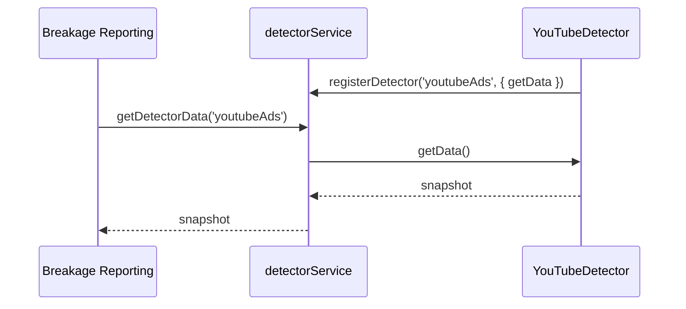

# Detector Registry (Prototype)

This directory contains a lightweight registry that runs inside content-scope-scripts. Detectors register with the shared service and any feature can query their latest results (breakage reporting, native PIR, debug tooling, etc.).

The initial focus is synchronous, on-demand collection. Continuous monitoring (mutation observers, polling, batching) can be layered on later without changing the public API.

## API Snapshot



### Core helpers

- `registerDetector(detectorId, { getData, refresh?, teardown? })`
- `unregisterDetector(detectorId)`
- `resetDetectors(reason?)`
- `getDetectorData(detectorId, { maxAgeMs }?)`
- `getDetectorBatch(detectorIds, options?)`

Detectors return arbitrary JSON payloads. Include timestamps if consumers rely on freshness.

## Directory Layout

```
detectors/
├── detector-service.js            # registry + caching helpers
├── default-config.js              # sample configuration blobs
├── detections/
│   ├── bot-detection.js           # helpers for CAPTCHA/bot detection
│   ├── fraud-detection.js         # helpers for anti-fraud banners
│   └── youtube-ads-detection.js   # helper for YouTube ad snapshots
├── detections/detection-base.js   # optional base for observer-style detectors
└── utils/
    └── detection-utils.js         # DOM helpers (selectors, text matching, visibility)
```

## Example Usage

```javascript
import { registerDetector, getDetectorData } from '../detectors/detector-service.js';
import { createBotDetector } from '../detectors/detections/bot-detection.js';
import { DEFAULT_DETECTOR_SETTINGS } from '../detectors/default-config.js';

// During feature init
registerDetector('botDetection', createBotDetector(DEFAULT_DETECTOR_SETTINGS.botDetection));

// Later, when preparing a breakage report
const snapshot = await getDetectorData('botDetection', { maxAgeMs: 1_000 });
if (snapshot?.detected) {
    payload.detectors.bot = snapshot;
}
```

## Extending

1. Add a helper under `detections/` that exposes a `createXDetector(config)` returning `{ getData, refresh?, teardown? }`.
2. Register it during feature bootstrap or via a shared initializer.
3. (Optional) Add defaults to `default-config.js` or wire it to remote config.

Future enhancements—shared observers, background aggregation, streaming updates—can build on this registry without breaking the public API.

