## Broker Protection

The following is a high-level description of how the Broker Protection actions are triggered by the native side. 

```mermaid
sequenceDiagram
    participant N as Native 💻
    participant W as Webview (broker-protection.js) 🌐
    participant E as Executor (execute.js) ⚙️
    W->>+W: DOMContentLoaded
    N->>W: 📩 onActionReceived(action, data)
    W->>E: execute(action, data)
    E-->E: Executing action
    Note right of E: ^ reading/writing values - side effects
    E->>W: SuccessResponse(result)
    W->>N: 📤 actionCompleted({ result })
    Note over N,W: ^ if successful, or:
    W->>N: 📤 actionError({ error })
    Note over N: Some time passes...
    N->>W: 📩 onActionReceived(action, data)
```



## Error Handling

Use `PirError` for typed errors throughout the broker-protection feature:

```js
import { PirError } from './types.js';

// Creating errors
if (!element) {
    return PirError.create('could not find element');
}

// Checking for errors
if (PirError.isError(result)) {
    return createError(result.error.message);
}

// Element validation pattern
if ((isInputElement(element) && ['text', 'hidden'].includes(element.type)) || isTextAreaElement(element)) {
    element.value = token;
} else {
    return PirError.create('element is neither a text input nor textarea');
}
```

**Key principles:**
- Always bubble up errors to avoid silent failures
- Use specific error messages that identify the failing operation
- Check `PirError.isError()` before accessing result values
