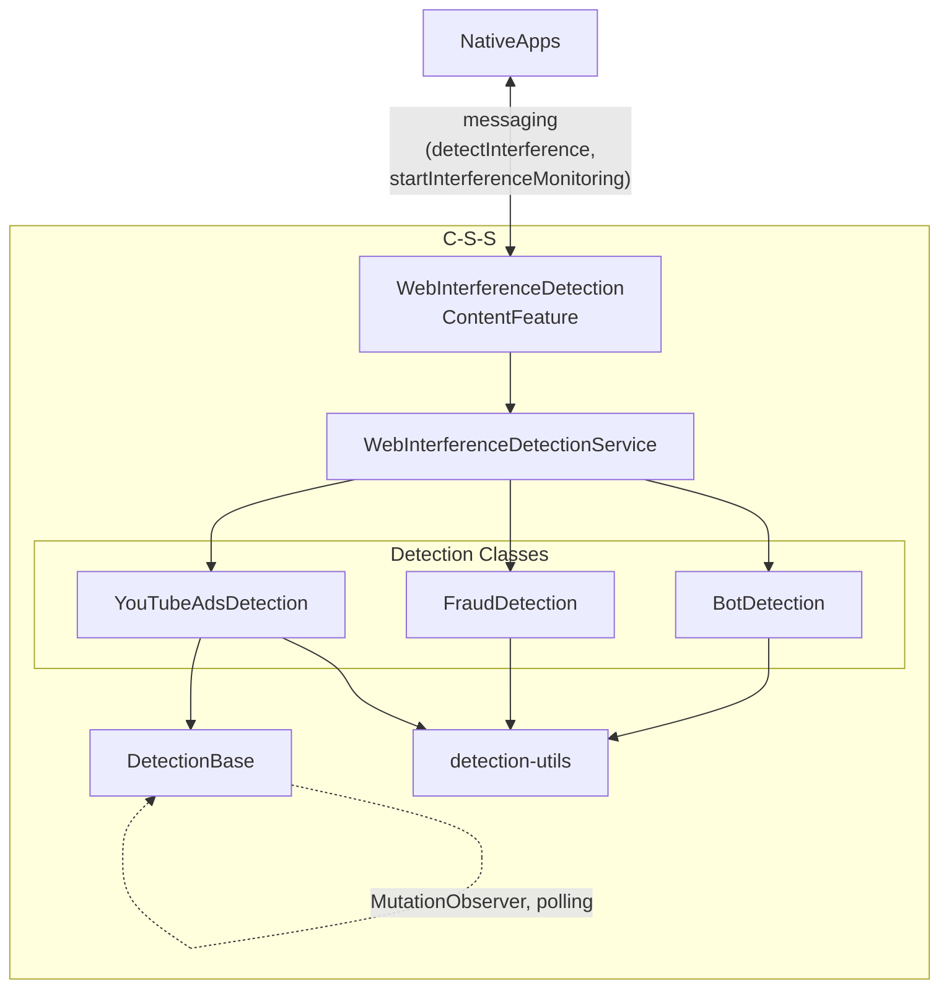

# Web Interference Detection Service

Detects bot challenges, anti-fraud warnings, and video ads on web pages. Supports on-demand detection and continuous DOM monitoring based on configuration.

## Architecture



### Folder Structure

```
web-interference-detection/
├── detector-service.js           # Main service orchestrator
├── default-config.js             # Default configuration
├── detections/
│   ├── bot-detection.js          # CAPTCHA detection
│   ├── fraud-detection.js        # Anti-fraud warnings
│   ├── youtube-ads-detection.js  # Video ad detection
│   └── detection-base.js         # Base class with observers
├── utils/
│   ├── detection-utils.js        # Shared utilities
│   └── result-factory.js         # Result creation
└── types/
    ├── detection.types.js        # Type definitions
    └── api.types.js              # API types
```

## Usage

### On-Demand Detection

```javascript
import { createWebInterferenceService } from './detector-service.js';

const service = createWebInterferenceService({
    interferenceConfig,
    onDetectionChange: null,
});

const results = service.detect({ types: ['botDetection'] });
```

**Full Response Example:**

```javascript
{
    botDetection: {
        detected: true,
        interferenceType: 'botDetection',
        results: [
            {
                detected: true,
                vendor: 'cloudflare',
                challengeType: 'cloudflareTurnstile',
                challengeStatus: 'visible'
            }
        ],
        timestamp: 1699283942123
    }
}
```

### Continuous Monitoring

```javascript
const service = createWebInterferenceService({
    interferenceConfig,
    onDetectionChange: (result) => {
        // Called when detection state changes (e.g., ad starts/stops)
        console.log('Interference changed:', result);
    },
});

service.detect({ types: ['youtubeAds'] });
// Service will monitor DOM changes and invoke callback

service.cleanup(); // Stop observers and cleanup
```

## Configuration Structure

```javascript
{
    settings: {
        botDetection: {
            cloudflareTurnstile: {
                state: 'enabled',
                vendor: 'cloudflare',
                selectors: ['.cf-turnstile', 'script[src*="challenges.cloudflare.com"]'],
                windowProperties: ['turnstile'],
                statusSelectors: [
                    {
                        status: 'solved',
                        selectors: ['[data-state="success"]']
                    },
                    {
                        status: 'failed',
                        selectors: ['[data-state="error"]']
                    }
                ],
                observeDOMChanges: false
            }
        },
        youtubeAds: {
            rootSelector: '#movie_player',
            watchAttributes: ['class', 'style', 'aria-label'],
            selectors: ['.ytp-ad-text', '.ytp-ad-skip-button', '.ytp-ad-preview-text'],
            adClasses: ['ad-showing', 'ad-interrupting'],
            textPatterns: ['skip ad', 'sponsored'],
            textSources: ['innerText', 'ariaLabel'],
            pollInterval: 2000,
            rerootInterval: 1000,
            observeDOMChanges: true
        },
    }
}
```

## Key Concepts

**Interference Types**:

- `botDetection` for bor detection mechanisms (captchas, cloudflare, etc)
- `fraudDetection` for anti-fraud warnings
- `youtubeAds` for youtube video ads

**Config-Driven Behavior**: Each interference type has independent configuration. Set `observeDOMChanges: true` to enable continuous monitoring for that specific interference type.

**Service Lifecycle**: The service is created once during feature initialization and reused throughout the page lifecycle. Call `detect(request)` with specific interference types whenever detection is needed. Call `cleanup()` when the page is unloaded to stop all active observers and polling.

**Messaging**: Use `detectInterference` for on-demand checks. Use `startInterferenceMonitoring` for continuous observation with callbacks.

## Caveats

⚠️ **MutationObserver/Polling Reuse**: Current implementation creates new observers for each `detect()` call if `observeDOMChanges: true`. Multiple detections may create redundant observers and affect performance. Future iterations should consider one or more of:

- Observer pooling/reuse across detections
- Debouncing detection calls
- Centralized DOM observation with multiplexed callbacks
