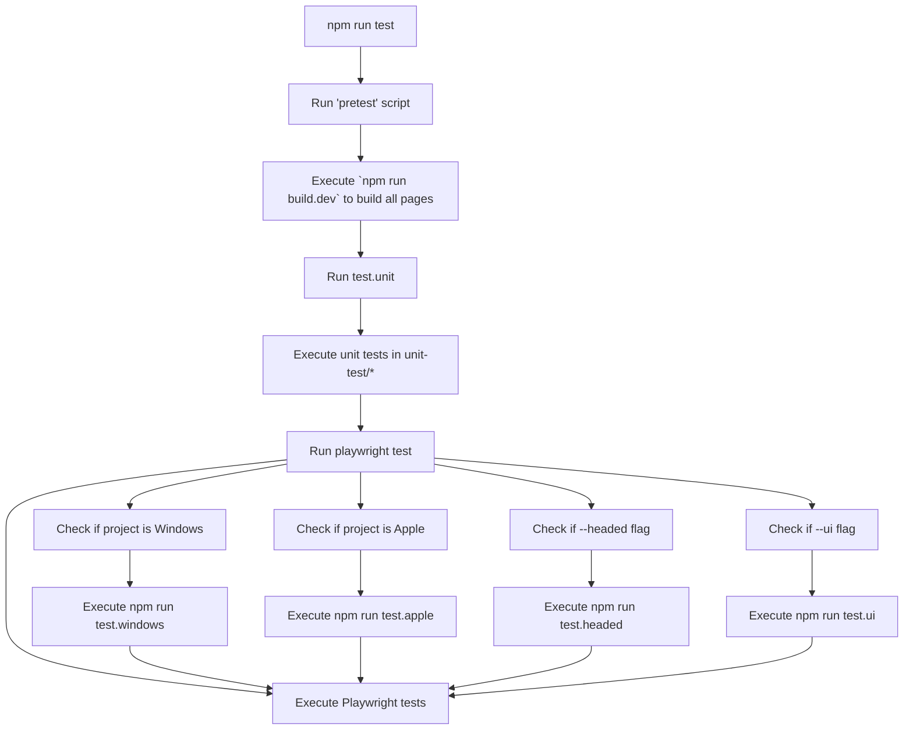

## Architecture

Special Pages gives us a single place to implement isolated HTML/CSS/Javascript projects that can be loaded into a web context that has privileged access to API.

- `packages/special-pages/pages/example`
- `packages/special-pages/pages/duckplayer`
- `packages/special-pages/pages/errorpage`

Would translate into the following build output

- `build/apple/pages/example`
- `build/apple/pages/duckplayer`
- `build/windows/pages/example`
- `build/windows/pages/duckplayer`

This allows each respective platform to configure their integrations to use the known page.

## Running Tests
 
To run tests, use the script command `npm run test`. The process is as follows:

## Running tests for a single platform

You can run `npm run test.windows` or `npm run test.macos` to run only tests for a single platform. Consult the file `playwright.config.js` to see what's available.
