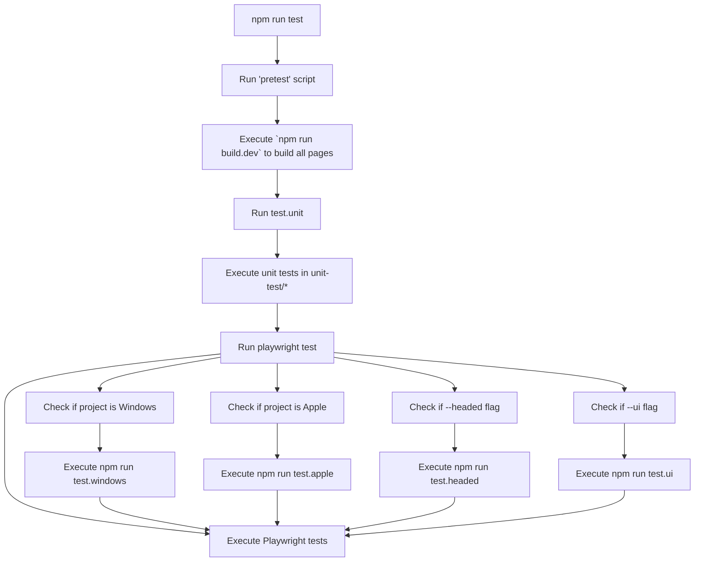

# Special Pages

## Overview

Special Pages gives us a single place to implement isolated HTML/CSS/Javascript projects that can be loaded into a web context that has privileged access to API.

## Getting Started with Special Pages Development

### Prerequisites

Before starting Special Pages development, ensure you have completed the initial setup:

> **Repository access and initial setup**: See [Development Utilities - Development Setup](../injected/docs/development-utilities.md#development-setup) for repository access, cloning, and initial build setup.

### Step 1: Make a Change to the 'Example' Special Page

Edit the file `App.jsx` within `special-pages/pages/example/app/components`

### Step 2: Rebuild

Since Content Scope Scripts contains additional projects, you can just rebuild the special-pages parts:

```shell
cd special-pages
npm run build
```

### Step 3: Review Your Change

Still within `special-pages`, you can now serve the built pages:

```shell
npm run serve
```

Then access the Example page you edited via: `http://127.0.0.1:3210/example/`

> **Note**: The output of the build command is just plain HTML/CSS/JS, so you can serve the build directory in any way that suits you.


### Step 4: Watch Mode

The build command builds every special page, but to run just 1 in isolation:

```shell
npm run watch -- --page=<page-directory-name>
```

Check the terminal for the dev URL, but it's normally `localhost:8000`.

> **Note**: Any changes you make here will not be automatically reflected in the build folder output.

### Step 5: Create a PR + Preview the Change

The PR build workflow creates a `pr-releases/<branch>` build branch and posts static preview links in the PR comment.

Use these entry points from that comment:
- docs: `/docs/index.html`
- static special pages: `/build/integration/pages/index.html`
- injected integration pages: `/injected/integration-test/test-pages/index.html`

## Architecture

Special Pages gives us a single place to implement isolated HTML/CSS/Javascript projects that can be loaded into a web context that has privileged access to API.

- `special-pages/pages/example`
- `special-pages/pages/duckplayer`
- `special-pages/pages/errorpage`

Would translate into the following build output

- `Sources/ContentScopeScripts/dist/pages/example`
- `Sources/ContentScopeScripts/dist/pages/duckplayer`
- `build/windows/pages/example`
- `build/windows/pages/duckplayer`

This allows each respective platform to configure their integrations to use the known page.

### Viewing pages locally

- `npm run build`
- `npm run serve`
  - This will serve the root folder of this repo
- Visit the URL of a page, for example
    - http://127.0.0.1:3210/build/integration/pages/duckplayer
    - http://127.0.0.1:3210/build/integration/pages/special-error

### Developing locally

When working in this section of the repo, one tends to be focused on a certain special-page. To keep the dev cycle quick, we serve the special-pages, then only watch files in the special-page where development is happening.

- `npm run serve-special-pages` run at the project root
- `npm run watch -- --page=<page-directory-name>` run in `special-pages/` directory
  - e.g. `npm run watch -- --page=new-tab`
  - Follow the link from this terminal window to http://localhost:8000/ for hot loading CSS updates and more

### Styles

Instead of dark mode media queries in the CSS, we rely on `data-theme` attribute set at the App level and update properties inside rules for `[data-theme=dark]` or `[data-theme=dark] &`. This does change the specificity of properties set in this selector vs a media query.

### Integration Tests

Ensure these commands are run from the `special-pages` folder.

```shell
# to have all platforms tested (minus screenshots)
npm run test-int
# to only run the iOS tests, likewise for the other platforms
npm run test-int -- --project ios
# to *only* run screenshot tests
npm run test.screenshots
# to also update screenshots (if you've made changes to anything visual)
npm run test.screenshots -- --update-snapshots
```

The process is as follows:


