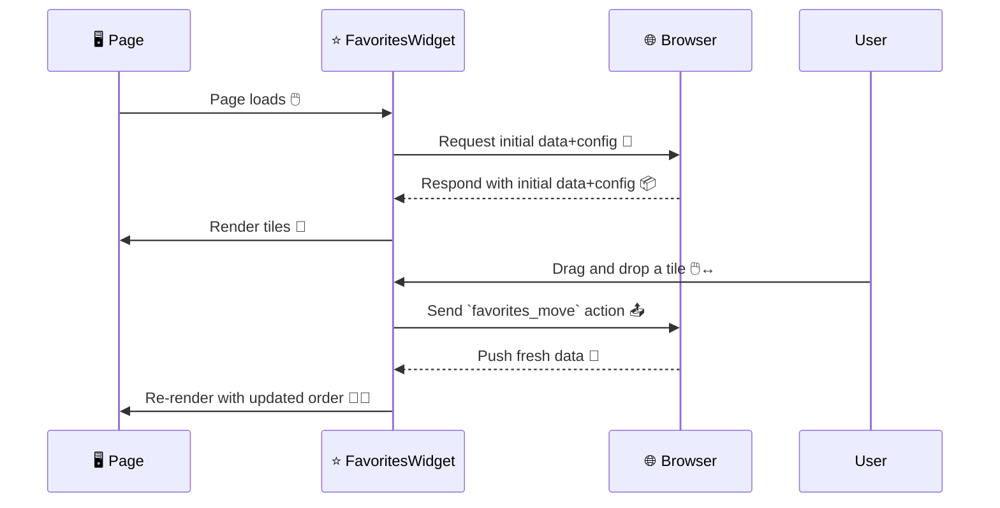

# Public API for the Favorites Widget.

## Diagrams

### Page Load + Move operation



## Requests:

- {@link "NewTab Messages".FavoritesGetDataRequest `favorites_getData`}
    - Used to fetch the initial data (during the first render)
    - returns {@link "NewTab Messages".FavoritesData}
- {@link "NewTab Messages".FavoritesGetDataRequest `favorites_getConfig`}
    - Used to fetch the initial data (during the first render)
    - returns {@link "NewTab Messages".FavoritesConfig}


## Subscriptions:

- {@link "NewTab Messages".FavoritesOnDataUpdateSubscription `favorites_onDataUpdate`}.
    - The tracker/company data used in the feed.
    - returns {@link "NewTab Messages".FavoritesData}
- {@link "NewTab Messages".FavoritesOnConfigUpdateSubscription `favorites_onConfigUpdate`}.
    - The widget config
    - returns {@link "NewTab Messages".FavoritesConfig}


## Notifications:

- {@link "NewTab Messages".FavoritesSetConfigNotification `favorites_setConfig`}
    - Sent when the user toggles the expansion of the favorites
    - Sends {@link "NewTab Messages".FavoritesConfig}
    - Example payload:
      ```json
      {
        "expansion": "collapsed"
      }
      ```
- {@link "NewTab Messages".FavoritesMoveNotification `favorites_move`}
    - Sends {@link "NewTab Messages".FavoritesMoveAction}
    - When you receive this message, apply the following
        - Search your collection to find the object with the given `id`.
        - Remove that object from its current position.
        - Insert it into the new position specified by `targetIndex`.
    - Example payload:
      ```json
      {
         "id": "abc",
         "targetIndex": 1
      }
      ```
- {@link "NewTab Messages".FavoritesOpenContextMenuNotification `favorites_openContextMenu`}
    - Sends {@link "NewTab Messages".FavoritesOpenContextMenuAction}
    - When you receive this message, show the context menu for the entity
- Example payload:
   ```json
   {
      "id": "abc"
   }
   ```
- {@link "NewTab Messages".FavoritesOpenNotification `favorites_open`}
    - Sends {@link "NewTab Messages".FavoritesOpenNotification}
    - When you receive this message, open the favorite in the given target
- Example payload:
   ```json
   {
      "id": "abc",
      "target": "same-tab"
   }
   ```
