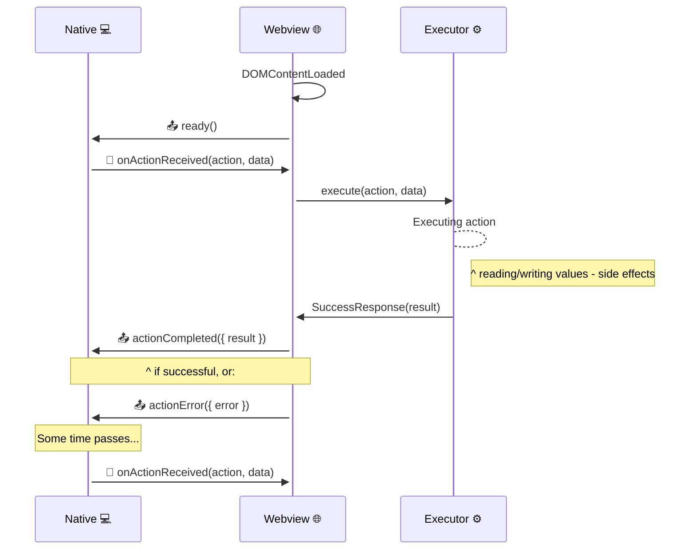

## Broker Protection

The following is a high-level description of how the Broker Protection actions are triggered by the native side. 

```mermaid
sequenceDiagram
    participant N as Native 💻
    participant W as Webview 🌐
    participant E as Executor ⚙️
    W->>+W: DOMContentLoaded
    W->>+N: 📤 ready()
    N->>W: 📩 onActionReceived(action, data)
    W->>E: execute(action, data)
    E-->E: Executing action
    Note right of E: ^ reading/writing values - side effects
    E->>W: SuccessResponse(result)
    W->>N: 📤 actionCompleted({ result })
    Note over N,W: ^ if successful, or:
    W->>N: 📤 actionError({ error })
    Note over N: Some time passes...
    N->>W: 📩 onActionReceived(action, data)
```
