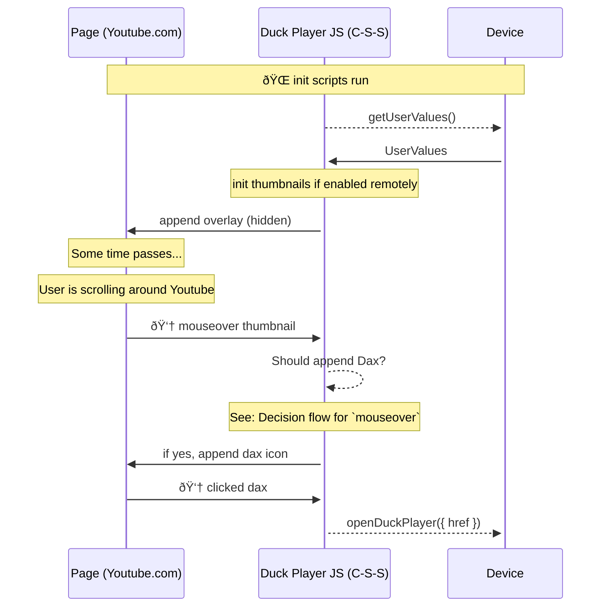
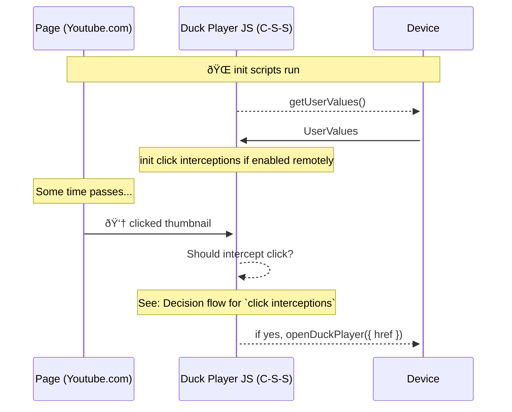

## Thumbnail hovers

This creates a diagram, please view on GitHub

```mermaid
sequenceDiagram
    participant P as Page (Youtube.com)
    participant JS as Duck Player JS (C-S-S)
    participant D as Device
    note over P,D: 🌠init scripts run
    JS-->>+D: getUserValues()
    D->>+JS: UserValues
    
    note over JS: init thumbnails if enabled remotely
    JS->>P: append overlay (hidden)
    note over P: Some time passes...
    note over P: User is scrolling around Youtube
    P->>JS: 👆 mouseover thumbnail
    JS-->>JS: Should append Dax? 
    note over JS: See: Decision flow for `mouseover`
    JS->>P: if yes, append dax icon
    P->>JS: 👆 clicked dax
    JS-->>D: openDuckPlayer({ href })   
```

## Thumbnail click interceptions

This creates a diagram, please view on GitHub

```mermaid
sequenceDiagram
    participant P as Page (Youtube.com)
    participant JS as Duck Player JS (C-S-S)
    participant D as Device
    note over P,D: 🌠init scripts run
    JS-->>+D: getUserValues()
    D->>+JS: UserValues
    
    note over JS: init click interceptions if enabled remotely
    note over P: Some time passes...
    P->>JS: 👆 clicked thumbnail
    JS-->>JS: Should intercept click?
    note over JS: See: Decision flow for `click interceptions`
    JS-->>D: if yes, openDuckPlayer({ href })   
```
